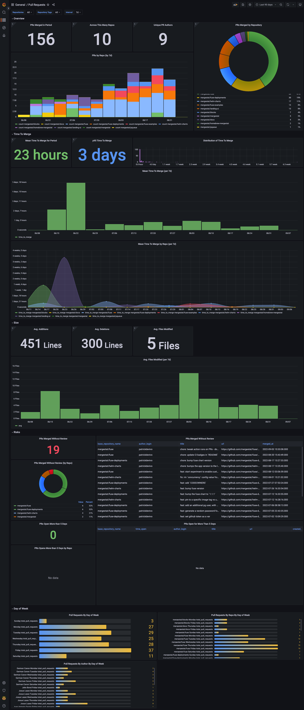

# MergeStat Fuse Examples

This repo holds re-usable templates and queries for data synced by MergeStat [Fuse](https://github.com/mergestat/fuse).
It also includes queires for managing a Fuse instance (adding/removing repos, data syncs, etc.)

Examples are saved in a "Source" and "Topic" directory structure, with different types of examples.

    |-- source
        |-- topic
            |-- example-type
                |-- screenshots
                    |-- example-screenshot.png    
                |-- example-file.ext

We will be constantly working on adding more content.
For now, here is the current state of what we are working on and some of the roadmap items we have:

- SQL (_in progress_)
- Grafana (_in progress_)
- Metabase (_roadmap_)
- Apache Superset (_roadmap_)

## GitHub Pull Requests Grafana Example Screenshot

## SQL Linting

The .sql files in this repo are linted using [sqlfluff](https://github.com/sqlfluff/sqlfluff) and .sqlfluff configuration file at the root of this repo.

To check for linting issues run this command from the root of the root directory

    sqlfluff lint

To force linting issue fixes run this command from the root of the root directory

    sqlfluff fix
